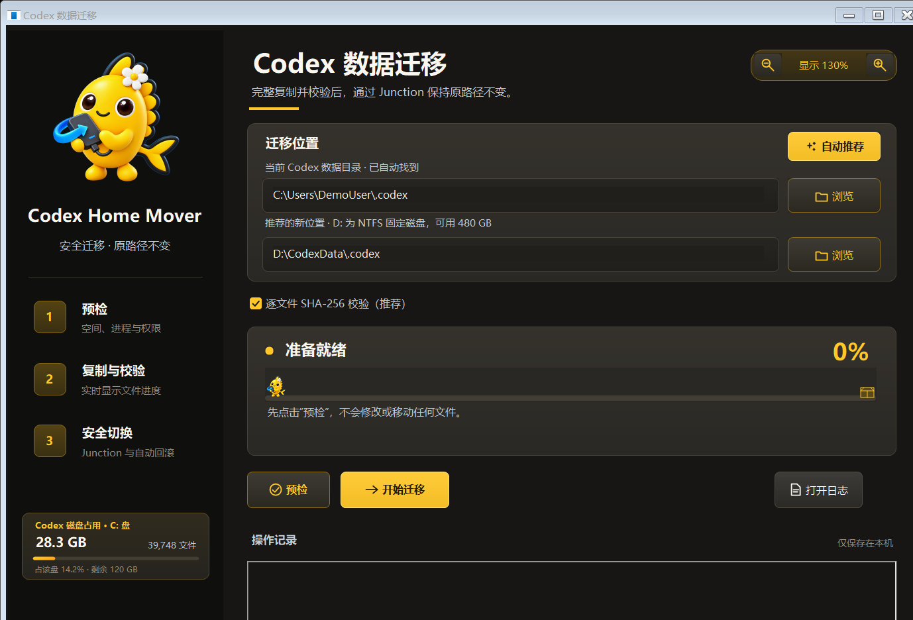

# Codex Home Mover

一个面向 Windows 的可视化迁移工具：把用户目录中的 `.codex` 完整迁移到其他 NTFS 固定磁盘，同时通过 NTFS 目录联接（Junction）保留原来的 `C:\Users\<用户名>\.codex` 路径。

> **非官方声明：**本项目是独立社区工具，与 OpenAI 无隶属、合作、赞助或背书关系。“OpenAI”“ChatGPT”“Codex”等名称归其各自权利人所有。

> [!WARNING]
> 本工具会以管理员权限修改目录结构和访问权限。重要资料请先独立备份；迁移期间不要关机或移除目标磁盘。“释放 C 盘空间”会永久删除安全备份，并且不会进入回收站。



## 它解决什么问题

- 将体积很大的 `.codex` 数据迁出 C 盘。
- 保持原路径不变，尽量避免旧任务中的本地文件链接失效。
- 先复制、再校验、最后切换，失败时保留 C 盘原目录或自动回滚。
- 提供空间统计、自动推荐、实时进度、日志、迁回和安全备份清理。

本工具只迁移 `.codex`。放在 D 盘或其他目录中的设计源文件不会被移动。

## 下载与系统要求

首个公开版本建议作为 **v0.1.0-beta.1 预发布版**发布。请从本项目的 GitHub Releases 下载完整 ZIP，解压后再运行；**不要只单独复制 EXE**，同目录的 `CodexHomeMover.exe.config` 包含长路径和 DPI 所需设置。

系统要求：

- Windows 10 或 Windows 11，64 位系统；
- .NET Framework 4.8；
- 管理员权限；
- 目标必须是本地、固定、持续在线且盘符稳定的 NTFS 磁盘；
- 目标可用空间应大于 `.codex` 当前数据量，并预留额外余量。

不要使用 exFAT、FAT32、网络盘、云同步目录或随时可能拔出的移动盘。

## 最简单的使用方法

1. 解压 Release ZIP，双击 `CodexHomeMover.exe`，允许管理员权限提示。
2. 点击“自动推荐”，检查当前目录和目标位置。
3. 保持“逐文件 SHA-256 校验（推荐）”勾选，然后点击“预检”。预检只读取和检查，可以保持 Codex 开启。
4. 预检通过后，保存工作并彻底退出 Codex 和 ChatGPT。
5. 点击“开始迁移”，完成前保持相关程序关闭。
6. 看到小鱼“搬家成功”弹窗后，重新打开 Codex。
7. 检查历史任务、图片、附件、本地文件链接，并新建一个小任务测试保存。
8. 确认一切正常后，再点击“释放 C 盘空间”。

不需要重启电脑。完成后，C 盘原路径会变成指向新目录的 Junction；资源管理器仍能访问该路径，但实际数据位于新磁盘。


## 安全机制

- 预检磁盘格式、容量、路径关系、权限和相关进程。
- 复制阶段支持长路径、断点式复用与安全取消。
- 默认逐文件 SHA-256 校验，并检查 SQLite 数据库完整性。
- 目标中的多余文件会进入隔离目录，不会直接删除。
- 最终切换前再次确认进程和源目录状态。
- 切换失败会自动回滚；成功后保留 C 盘安全备份。
- “迁回 C 盘”和“释放 C 盘空间”均校验迁移记录与路径状态。
- 程序不联网、没有遥测；日志仅保存在本机。

## 迁移后请检查

- Codex 可以正常启动并创建新任务；
- 历史任务、图片和附件可以打开；
- 关键设计文件链接仍然有效；
- `C:\Users\你的用户名\.codex` 仍然存在且可以访问；
- 目标磁盘保持在线，盘符没有改变。

在完成以上检查前，不要删除 C 盘安全备份，也不要手动改名或移动源目录、目标目录和备份目录。

## 常见问题

### 预检时需要关闭 Codex 吗？

不需要。只有开始迁移、迁回 C 盘和最终切换时必须退出 Codex/ChatGPT，并暂停其他正在浏览或写入 `.codex` 的程序。

### 以后 C 盘还会继续存很多内容吗？

正常情况下，`.codex` 的新增内容会经原路径写入目标磁盘。C 盘仍可能产生 Windows、应用缓存或其他软件的数据，但不再保存这份 `.codex` 主数据。Junction 显示的大小不等于 C 盘又复制了一份。

### 迁移失败后可以继续吗？

可以。在复制或校验阶段失败时保留目标副本，重新打开新版工具，确认路径后使用“仅用于失败后续传”选项。不要把它用于来历不明的已有目录。

### 为什么 Windows SmartScreen 会警告？

当前社区构建尚未购买代码签名证书，因此可能显示“未知发布者”。只从本项目正式 Release 下载完整 ZIP，并对照 Release 中的 SHA-256；不要关闭 Defender 或全局降低 Windows 安全设置。

### 日志在哪里？可以直接发到 Issue 吗？

日志位于 `%LOCALAPPDATA%\CodexHomeMover\logs`，最多保留当前日志和一个轮转日志。日志可能包含用户名、本地路径、文件名和进程 ID；提交问题前必须脱敏，不要上传 `.codex`、`auth.json`、数据库或完整日志。详见 [PRIVACY.md](PRIVACY.md)。

## 从源码构建与测试

构建脚本使用本机的 .NET Framework C# 编译器；若未找到，请安装 .NET Framework 4.8 Developer Pack。

```powershell
.\build.ps1 -Configuration Release -OutputName CodexHomeMover.exe
```

运行完整的本地迁移/回滚沙箱测试：

```powershell
.\test.ps1
```

生成可上传的干净预发布包：

```powershell
.\pack-release.ps1 -Version 0.1.0-beta.1
```

脚本会重新测试和构建、使用白名单打包、扫描本机路径/PDB 残留，并生成 SHA-256 校验文件。

## 参与贡献与安全问题

- 普通缺陷和建议：使用 GitHub Issue，并只提供脱敏信息。
- 安全漏洞：请不要创建公开 Issue，按照 [SECURITY.md](SECURITY.md) 使用 GitHub 私密漏洞报告。
- 开发约定与测试要求见 [CONTRIBUTING.md](CONTRIBUTING.md)。
- 发布历史见 [CHANGELOG.md](CHANGELOG.md)。

## 许可证与素材

源代码使用 [MIT License](LICENSE)。小鱼角色与应用图标由项目所有者原创设计，并已获准随本项目源码和官方发布包公开分发；它们不属于 MIT 授权范围，具体边界见 [ASSET-LICENSE.md](ASSET-LICENSE.md)。

## English summary

Codex Home Mover is an unofficial Windows utility that moves a user's `.codex` directory to another fixed NTFS drive while preserving the original path through a directory junction. It performs copy-first migration, optional per-file SHA-256 verification, rollback, and local-only logging. Download the complete Release ZIP and read the warnings above before use.
